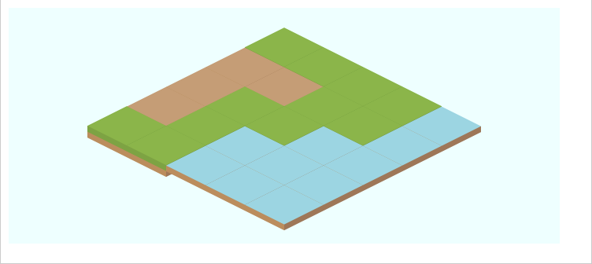

# Pixi.js Isometric Map Part 2 - Tiles with Height

:::BEGIN Example

In this example a spritesheet is loaded (generated by Projmate) from the wonderful
[Isometric Road Tiles (nova) by Kenney](http://kenney.nl/assets).

Once loaded an isometric map is rendered using `Frames` from the loaded spritesheet.

{{{EXAMPLE style='height: 310px;'}}}


## Setup Stage and Renderer

Setup the stage as usual.

```js
var WIDTH = 700;
var HEIGHT = 300;
var stage = new PIXI.Stage(0xEEFFFF);
var renderer = PIXI.autoDetectRenderer(WIDTH, HEIGHT);
document.body.appendChild(renderer.view);
```

## Loading the Sprite Sheet

Loading the SpriteSheet is as simple as specifiying the URL to the JSON file
and assigning a handler to `loader.onComplete`. Pixi.js
treats a JSON file as Texture Packer metadata. With this metadata,
Pixi.js is able to load images from areas in the spritesheet and creates a `Frame`
for each.

Frame are used to construct `Texture` objects which in turn are used to create `Sprite` objects.

```js
var loader = new PIXI.AssetLoader(['img/roadTiles.json']);
```

## Map and Tile Metadata

Here is the map we want to render on the stage.

```js
// map
var G=0, D=1, W=2;
var terrain = [
    [G, G, G, G, W],
    [D, D, G, G, W],
    [D, G, G, W, W],
    [D, G, W, W, W],
    [G, G, W, W, W],
];

// Tiles with height can exceed these dimensions.
var tileHeight = 50;
var tileWidth = 50;

// tiles
var grass = isoTile('grass.png');
var dirt = isoTile('dirt.png');
var water = isoTile('water.png');
var sand = isoTile('beach.png');
var tileMethods = [grass, dirt, water, sand];
```

## Drawing Tiles

In an earlier tutorial, flat isometric tiles were drawn from the north corner. We quickly see
an error in that logic. Tiles with height (z-direction) seem to float as they are drawn
from the top instead of the bottom. Ooops!

:::@ --no-capture

```js
function isoTile(filename) {
  return function(x, y) {
    var tile = PIXI.Sprite.fromFrame(filename);
    tile.position.x = x;
    tile.position.y = y;

    // middle-top
    tile.anchor.x = 0.5;
    tile.anchor.y = 0;
    stage.addChild(tile);
  }
}
```



The water and dirt appear to float at top of the grassline. The fix
is to draw tiles from the bottom left. Fortunately,
Pixi provides an anchor property. Too easy!

```js
function isoTile(filename) {
  return function(x, y) {
    var tile = PIXI.Sprite.fromFrame(filename);
    tile.position.x = x;
    tile.position.y = y;

    // bottom-left
    tile.anchor.x = 0;
    tile.anchor.y = 1;
    stage.addChild(tile);
  }
}
```

## Rendering the Isometric Map

The map is drawn as before with the x-axis increasing
in southeast direction and the y-axis increasing in a southwest direction.

```js
function drawMap(terrain, xOffset, yOffset) {
    var tileType, x, y, isoX, isoY, idx;

    for (var i = 0, iL = terrain.length; i < iL; i++) {
        for (var j = 0, jL = terrain[i].length; j < jL; j++) {
            // cartesian 2D coordinate
            x = j * tileWidth;
            y = i * tileHeight;

            // iso coordinate
            isoX = x - y;
            isoY = (x + y) / 2;

            tileType = terrain[i][j];
            drawTile = tileMethods[tileType];
            drawTile(isoX + xOffset, isoY + yOffset);
        }
    }
}

```

Everything is ready. Tell the loader to load and when it finishes
`start` puts the example in motion.

```js
loader.onComplete = start;
loader.load();

function start() {
  drawMap(terrain, WIDTH / 2, tileHeight * 1.5);

  function animate() {
    requestAnimFrame(animate);
    renderer.render(stage);
  }
  requestAnimFrame(animate);
}
```

:::> support/common.md

:::END
